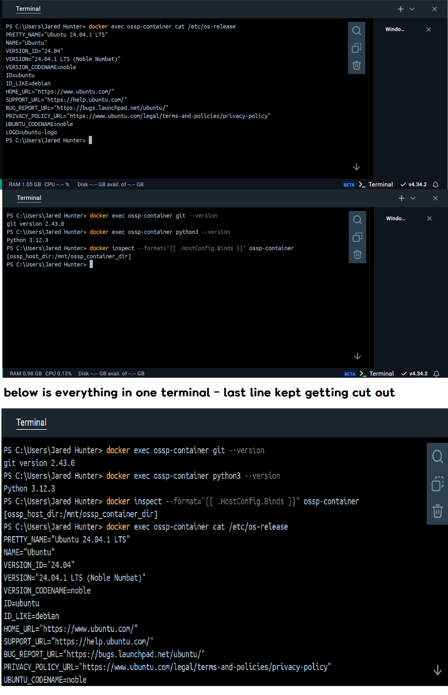

# SWE_2021_41_2024_2_week_6
## Week 4
### Assignment: Complete Python code for judging if a number is 'happy' or not
* Link to Repository
<pre> <code><a href= "https://github.com/ChaeheonLee/SWE_2021_41_2024_2_week_4">https://github.com/ChaeheonLee/SWE_2021_41_2024_2_week_4</a></code> </pre>

* Part-by-Part Code Description

__First Part__
> ```python
> def isHappy(n):
>   if n == 1 or n == 7:                # both numbers which are happy numbers
>     return True
>   if n < 10:                          # other than 1 and 7, all numbers under 10 loop
>     return False
> ```
The basic assumption here is that at some point, all numbers passed through the 'happy process' (e.g. adding up each squared digit) will hit a number under 10. For example:

> if n = 50  
> $5^2$ + $0^2$ = 25  
> $2^2$ + $5^2$ = 29  
> $2^2$ + $9^2$ = 85  
> $8^2$ + $5^2$ = 89  
> $8^2$ + $9^2$ = 145  
> $1^2$ + $4^2$ + $5^2$ = 42  
> $4^2$ + $2^2$ = 20  
> $2^2$ + $0^2$ = 4

(It might be that this assumption is only applicable because of the constraint on n, which is that 0 < n < $2^{32}$-1)
<br>
<br>
In any case, the only happy numbers out of 1 ~ 9 are 1 and 7. Which means for n < 10, if n is not 1 or 7, then it can be thrown out as a non-happy number straight away.
<br>
<br>
<br>
__Second Part__

> ```python
> #indent preserved
> num = list(map(int, str(n)))        # map all digits in number to list
> ```
Here, n is converted into strings, then listed again after being re-converted to integers. This has the effect of seperating the number into seperate digits. Therefore, num is a list of intergers, with each element being a digit of n.
<br>
<br>
<br>
__Third Part__

> ```python
> #indents preserved, comment edited slightly
>   while(1):
>    sq = 0
>    for i in num:
>      sq = sq + i**2
>    if sq == 1 or sq == 7:
>      return True
>    elif sq < 10:                     # this assumes all numbers will at some point add up to a number under 10
>      return False                    # thus if at no point do those digits == 1 or 7, then they are not happy
>    num = list(map(int, str(sq)))     # re-map (update) digits of number to list
> ```
We follow the 'happy process', adding the squares of each digit, checking, and re-updating the list as neccessary.
<br>
<br>
If the sum of these, sq, hits a number under 10 and the single-digit number is not 1 or 7, this has no hope of being a happy number. Thus we return FALSE.
<br>
<br>
However if it *is* 1 or 7, then this is a happy number! We celebrate by returning TRUE.
<br>
<br>
<br>
* Complete Code
```python
def isHappy(n):
  if n == 1 or n == 7:                # both numbers which are happy numbers
    return True
  if n < 10:                          # other than 1 and 7, all numbers under 10 loop
    return False
  num = list(map(int, str(n)))        # map all digits in number to list
  while(1):
    sq = 0
    for i in num:
      sq = sq + i**2
    if sq == 1 or sq == 7:
      return True
    elif sq < 10:                     # note: this assumes all numbers at some point will have digits adding up to a number under 10, e.g., 11 -> 1 + 1 = 2
      return False                    # thus if at no point do those digits == 1 or 7, then they are not happy
    num = list(map(int, str(sq)))     # re-map (update) digits of number to list
```
 ___

## Week 5
### Assignment: Basic Docker Setup
> * Line-by-Line
>   
> Check Git version installed in container named 'ossp-container'
>> ```go
>> docker exec ossp-container git --version
>> ```
>
> Check version of Python 3 installed in 'ossp-container'
> 
>> ```go
>> docker exec ossp-container python3 --version
>> ```
>
> Print path of host directory mounted in 'ossp-container'
> 
>> ```go
>> docker inspect --format="{{ .HostConfig.Binds }}" ossp-container
>> ```
>
> Result:
> 
>> ```go
>> // this is a merged version, they did not actually come out like this
>> git version 2.43.0
>> Python 3.12.3
>> [ossp_host_dir:/mnt/ossp_container_dir]
>> ```
>
> The first part of line 3 is the host directory, followed by the container directory. The host directory was created and mounted beforehand.
>
> And lastly, checking the version of Linux currently being used
>> ```go
>> docker exec ossp-container cat /etc/os-release
>> ```
> Result is not reproduced here because it is too long.
>
> Screenshots of complete process:
>> 
> .

##### <u> THANK YOU FOR READING!!! 😄 </u>
